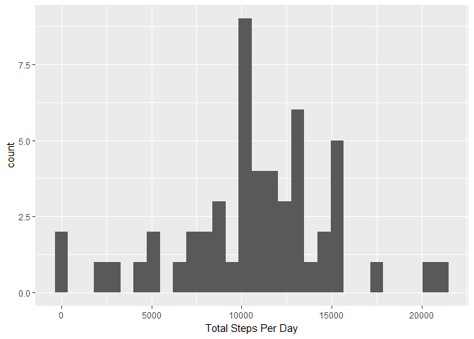
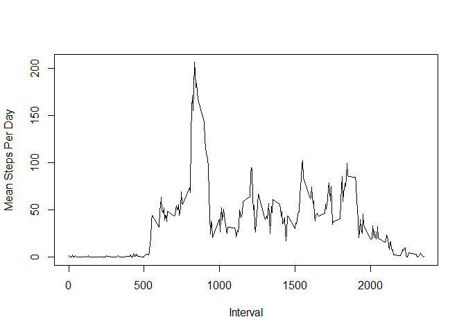
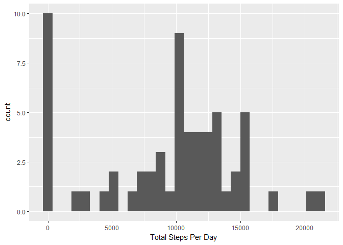
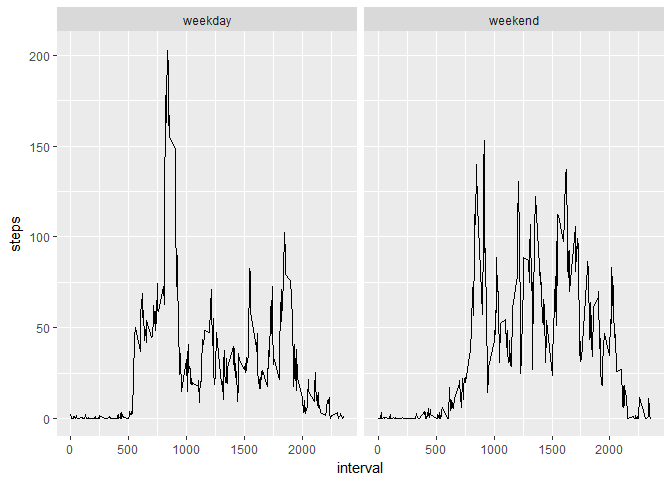

# Course Project 1 Reproducible Research


## Peer-graded Assignment: Course Project 1 Reproducible Research

###Loading and preprocessing the data


```r
activity<-read.csv("activity.csv", stringsAsFactors=FALSE, na.strings = "NA") #Read in Dataset (Make sure to set working Directory)
activityWithNA<-activity #stores original dataset for use in later question
activity<-activity[complete.cases(activity),]  #removes rows with incomplete data 
```


###What is mean total number of steps taken per day? For this part of the assignment, you can ignore the missing values in the dataset.

####1. Calculate the total number of steps taken per day


```r
totalPerDay<-aggregate(activity[, 1], list(activity$date), sum) #substes data based on dates and sums data per day
```

####2. Make a histogram of the total number of steps taken each day


```r
library(ggplot2) 
```

```
## Warning: package 'ggplot2' was built under R version 3.2.5
```

```r
qplot(totalPerDay$x,xlab = "Total Steps Per Day", bins=30) # plots data
```

<!-- -->

####3.Calculate and report the mean and median of the total number of steps taken per day


```r
totalPerDay<-aggregate(activity[, 1], list(activity$date), sum) #substes data based on dates
meanTotalStepsPerDay<-mean(totalPerDay$x) 
medianTotalStepsPerDay<-median(totalPerDay$x) 
#Display answers
meanTotalStepsPerDay
```

```
## [1] 10766.19
```

```r
medianTotalStepsPerDay
```

```
## [1] 10765
```

###What is the average daily activity pattern?

####1.Make a time series plot (i.e. type = "l") of the 5-minute interval (x-axis) and the average number of steps taken, averaged across all days (y-axis)

```r
meanPerDay<-aggregate(activity[, 1], list(activity$interval), mean) #substes data based on Interval
plot(meanPerDay$Group.1,meanPerDay$x, type="l", xlab="Interval",ylab = "Mean Steps Per Day")
```

<!-- -->

####2.Which 5-minute interval, on average across all the days in the dataset, contains the maximum number of steps?

```r
max(meanPerDay$x)
```

```
## [1] 206.1698
```

###Imputing missing values
####1.Calculate and report the total number of missing values in the dataset (i.e. the total number of rows with NAs)

```r
RowsWithNA<-length(activityWithNA$date)-length(activity$date) #subtracts dataset where NA rows were removed from original dataset 
RowsWithNA #Display number of rows with missing data points
```

```
## [1] 2304
```

####2.Devise a strategy for filling in all of the missing values in the dataset. The strategy does not need to be sophisticated. For example, you could use the mean/median for that day, or the mean for that 5-minute interval, etc.

Strategy: NA Values will be replaced with "Zero"

####3.Create a new dataset that is equal to the original dataset but with the missing data filled in.

```r
imputedActivity<-activityWithNA #Variable for new data
imputedActivity[is.na(activityWithNA$steps),1]<-0 #Checks for missing data and assigns zero in the "Steps" Column
```

####4. Make a histogram of the total number of steps taken each day and Calculate and report the mean and median total number of steps taken per day. 


```r
totalImputedPerDay<-aggregate(imputedActivity[, 1], list(imputedActivity$date), sum) #substes data based on dates and sums data per day

qplot(totalImputedPerDay$x,xlab = "Total Steps Per Day", bins=30) # plots data
```

<!-- -->

```r
meanTotalImputedStepsPerDay<-mean(totalImputedPerDay$x) 
medianTotalImputedStepsPerDay<-median(totalImputedPerDay$x) 
#Display answers
meanTotalImputedStepsPerDay
```

```
## [1] 9354.23
```

```r
medianTotalImputedStepsPerDay
```

```
## [1] 10395
```

####Do these values differ from the estimates from the first part of the assignment? What is the impact of imputing missing data on the estimates of the total daily number of steps?
Yes, the impact lowers both values. The method used was simply to replace any missing values with a zero value so it is expected this will shift the dataset statistics.


```r
#Disply difference in values from original dataset where NA values were ignored:
meanTotalStepsPerDay-meanTotalImputedStepsPerDay
```

```
## [1] 1411.959
```

```r
medianTotalStepsPerDay-medianTotalImputedStepsPerDay
```

```
## [1] 370
```

###Are there differences in activity patterns between weekdays and weekends?
####1.Create a new factor variable in the dataset with two levels - "weekday" and "weekend" indicating whether a given date is a weekday or weekend day.

```r
#Used weekdays(x=as.Date(seq(7), origin="2017-01-15")) to print out days of week
imputedActivity$days<-weekdays(as.Date(imputedActivity$date)) #Creates a new column and fills it with the day of the week based on the date

#Transfer day of the week to "weekday" or "weekend"
imputedActivity$days[imputedActivity$days %in% c("Saturday", "Sunday") ] <- "weekend" 
imputedActivity$days[imputedActivity$days %in% c("Monday", "Tuesday", "Wednesday", "Thursday", "Friday" ) ] <- "weekday"
imputedActivity$days<-as.factor(imputedActivity$days) #convert from char to factor
```
####2.Make a panel plot containing a time series plot (i.e. type = "l") of the 5-minute interval (x-axis) and the average number of steps taken, averaged across all weekday days or weekend days (y-axis).

```r
imputedMeanPerDay<-aggregate(steps~interval+days, data=imputedActivity, mean) #Finds mean and groups based on interval
imputedMeanPerDay$days<-as.factor(imputedMeanPerDay$days) #convert from char to factor

#Plot data based on weekday/weekend interval
ggplot(imputedMeanPerDay,aes(interval,steps))+geom_line()+facet_grid(~days)# weekdays(as.Date(imputedActivity$date))
```

<!-- -->
